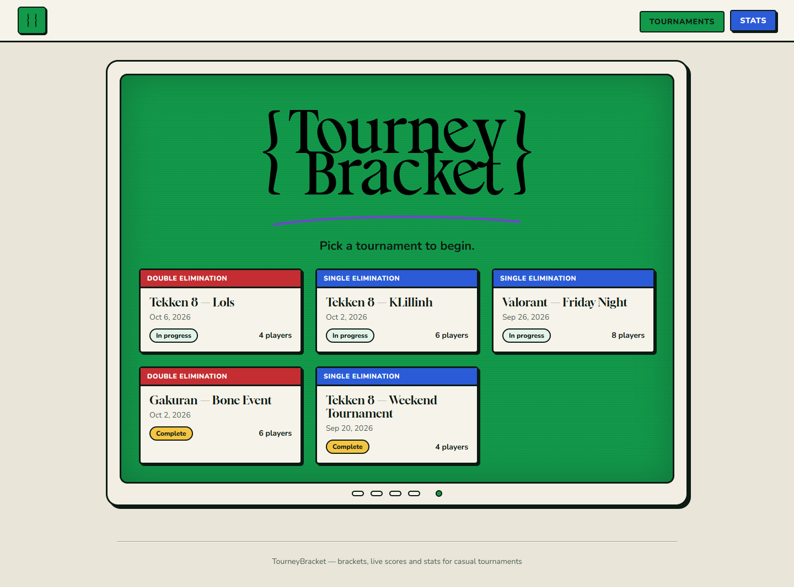
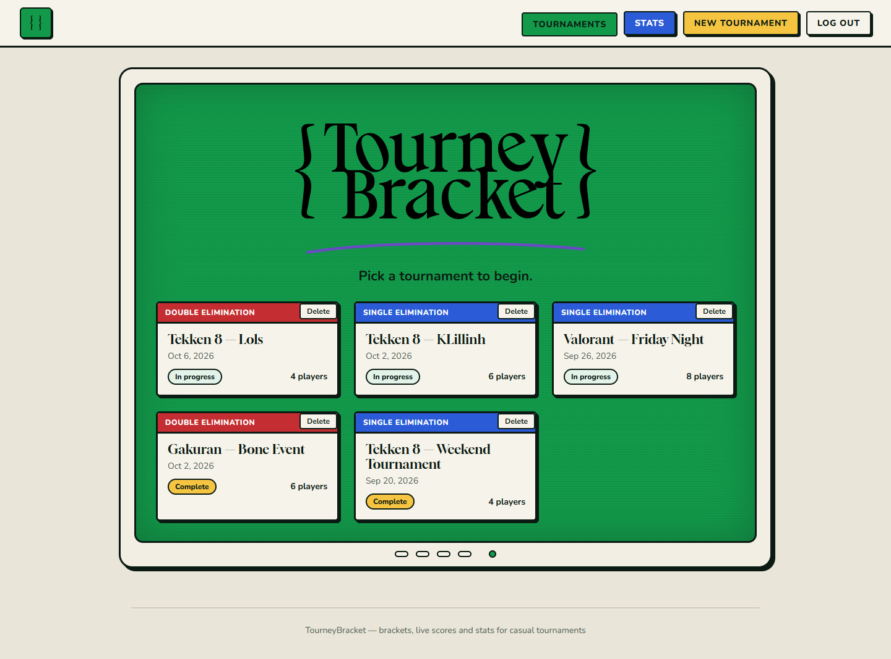
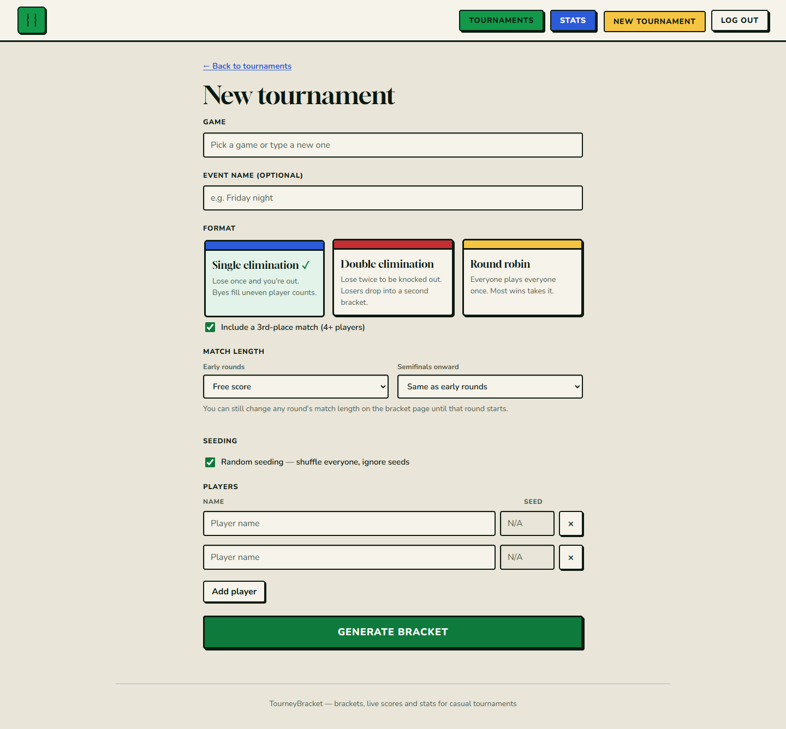
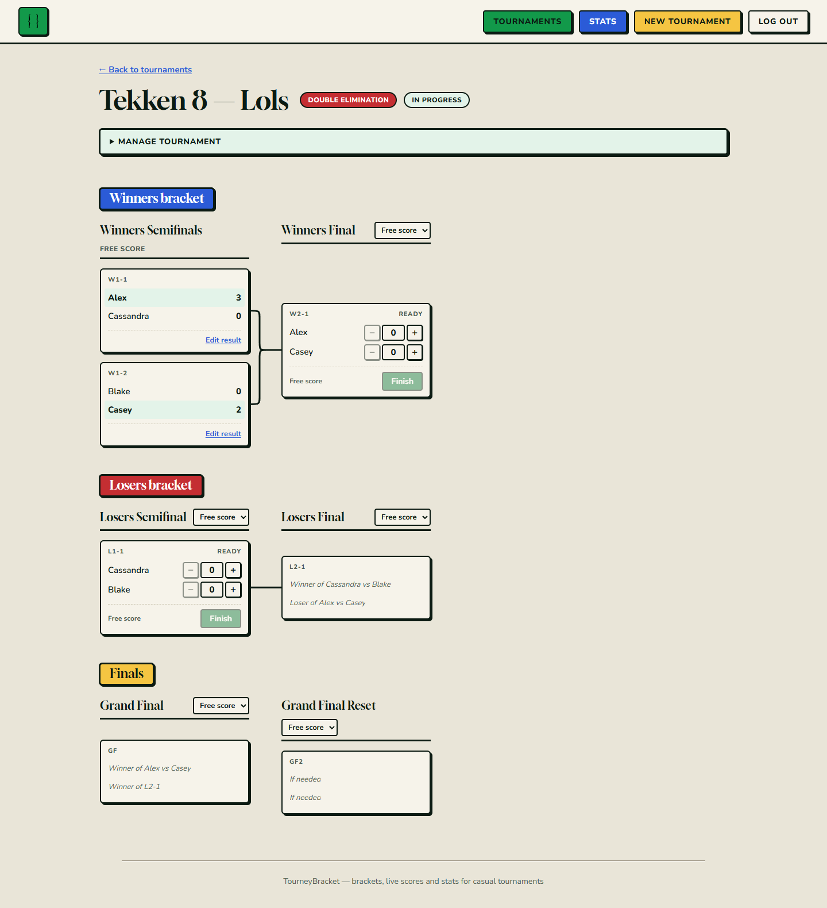
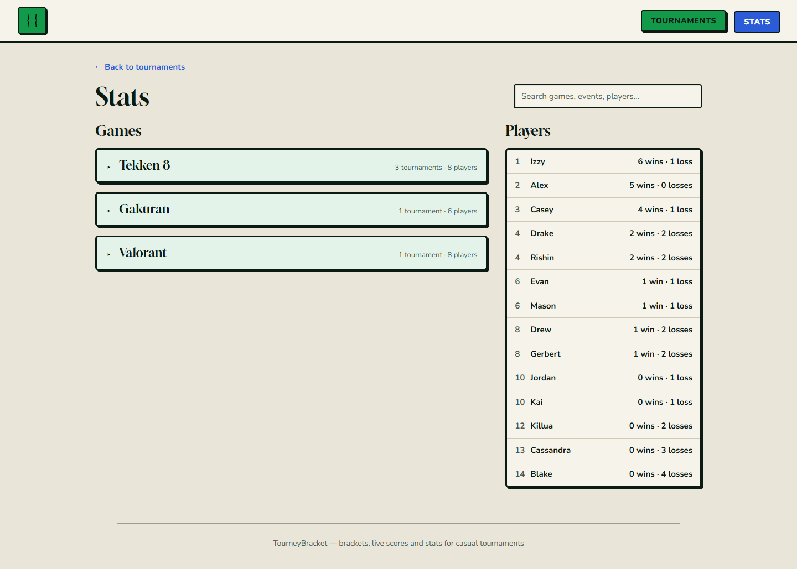
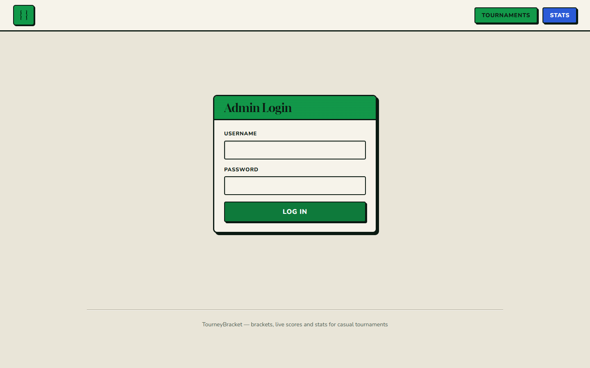
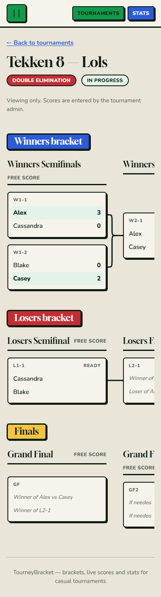

# Mockup

The mockup was designed in Figma, using the logo and colour palette that the
built app now follows. The images below are screenshots of the finished app,
showing every screen in the proposal with real content.

| Screen | Image |
|---|---|
| Tournaments, as a visitor sees them |  |
| Tournaments, with the admin's controls |  |
| New tournament (setup) |  |
| A bracket, with live scoring |  |
| Stats |  |
| Admin login |  |
| A bracket on a phone |  |

## Empty state

With no tournaments, the Tournaments page says "No tournaments yet. Start one
with New tournament." to the admin and "No tournaments yet. Check back soon." to
visitors. While data is loading it says "Loading tournaments…".

## On a phone

Every screen works at 375 px wide. The bracket scrolls sideways inside its own
area, and the Stats page's two columns stack.

## Differences from the Figma mockup

None worth noting in layout. The bracket's curly-brace connectors between rounds
were added during building.
